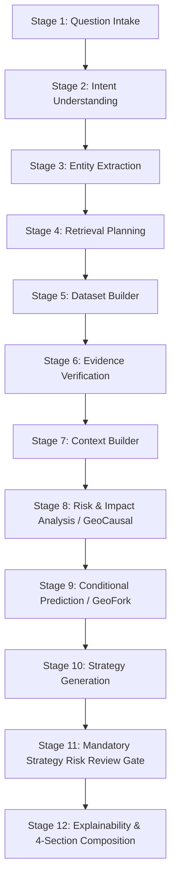

# GeoSentinel — System Build Specification

> **Version**: 1.0  
> **Date**: 25 September 2026  
> **Status**: APPROVED / ACTIVE  
> **Source**: GeoSentinel Complete System Build Specification (Antigravity v1.0) & Master Autonomous Development Prompt

---

## 1. Project Overview & Identity

- **Project Name**: GeoSentinel
- **Full Title**: *"GeoSentinel: An Explainable Multi-Agent AI Framework for Global Event Intelligence and Impact Prediction"*
- **Core Mission**: Build an evidence-grounded AI decision-support system that retrieves publicly available and authorized global event data, verifies source provenance, analyzes geopolitical and global events, evaluates potential impacts, generates conditional scenarios, and presents explainable strategy options with risks, trade-offs, mitigations, and uncertainty.
- **Classification**: Research-oriented MVP. Must be technically functional, transparent, reproducible, and extensible.
- **Core Boundaries**: Not an autonomous decision-maker. Must not claim global completeness, guaranteed forecasting, or that AI can independently resolve geopolitical conflicts.

---

## 2. Binding Principles & Non-Negotiable Rules

1. **Zero Paid Data Resources**:
   - Zero dependence on paid APIs, subscriptions, premium tiers, or proprietary paywalled datasets.
   - Use only verified free public APIs and datasets whose terms permit research and AI processing.
   - Any source with unclear terms or payment barriers is marked `LICENSE_CHECK` and disabled.
2. **No Fabricated Data**:
   - Never generate hallucinated events, fake news, synthetic citations, phantom statistics, or fake model performance.
   - Synthetic data is strictly restricted to labeled development fixtures (`data/synthetic_demo/`).
3. **Mandatory Independent Strategy Risk Review Gate**:
   - Every generated strategy must be independently evaluated for unintended consequences, second-order effects, escalation risks, legal/ethical bounds, and vulnerable populations.
   - The Risk Review Agent is logically independent and acts as a blocking gate before implementation-ready advice.
   - Never label any strategy as "risk-free" or "guaranteed".
4. **Evidence & Provenance Integrity**:
   - Every material factual claim must trace directly to evidence records with timestamps, URL/source IDs, and verification states (`UNVERIFIED`, `SOURCE_REFERENCED`, `CROSS_CHECKED`, `VERIFIED`, `CONFLICTING`, `REJECTED`).
   - Distinguish primary sources from syndicated copies. Preserve contradictions.
5. **Defensive Security & No Unauthorized Access**:
   - Strict SSRF protection, prompt injection defenses, input sanitization, JWT validation, and RBAC.
   - No private account access, no unauthorized scraping, and no circumvention of network controls.

---

## 3. Technology Stack & Target Architecture

| Component | Technology | Responsibilities |
| :--- | :--- | :--- |
| **Frontend** | React 18+, TypeScript, Vite, Tailwind CSS, Lucide Icons | Responsive UI, 4-section analysis view, interactive evidence explorer, strategy matrix, admin controls |
| **Backend API** | Java 21 / Spring Boot 3.x, Spring Security, JWT | Public REST API (`/api/v1`), Auth/RBAC, CRUD, Session isolation, Audit logging, Flyway migrations |
| **AI Service** | Python 3.11+, FastAPI, Pydantic v2 | 12-stage multi-agent pipeline, Dataset Builder, Evidence Verification, GeoCausal, GeoFork, Strategy Risk Gate |
| **Primary Database** | MySQL 8.x / PostgreSQL (Relational with Flyway migrations) | Identity, RBAC, Sessions, Questions, Analysis Runs, Evidence, Events, Sources, Strategies, Audit Logs |
| **Knowledge Graph** | Relational / In-Memory Graph Abstraction (Optional Neo4j) | Entity-Event-Evidence causal and dependency relationships, session-isolated temporary graph |
| **Infrastructure** | Docker Compose, Maven Wrapper, npm/vite, pytest | Reproducible local execution, environment-based configuration, health probes |

---

## 4. Canonical 12-Stage Question Pipeline

GeoSentinel processes analytical questions through a 12-stage sequential, validated pipeline:

---

## 5. Mandatory Four-Section Response Schema

Every completed GeoSentinel response must produce:

1. **Current Situation**: Dated synthesis distinguishing verified facts, claims, and inferences.
2. **Relevant Evidence**: Detailed table of source names, URLs, published/retrieved timestamps, verification states, and conflict notes.
3. **Impact Analysis**: Direct, indirect, and second-order pathways across sectors, regions, and horizons (short/medium/long).
4. **Strategy Recommendations**: Specific policy/action options with objectives, causal mechanisms, prerequisites, trade-offs, **independent risk review findings**, required mitigations, residual risks, and fallback triggers.
